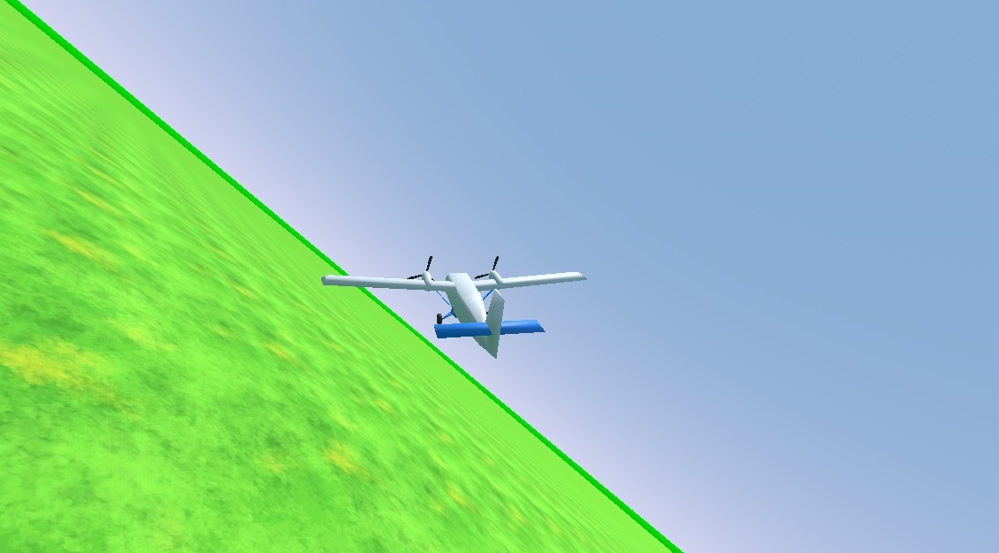

# Simple (arcade style) airplane controller for Godot (C#)

Free to use in your own projects, licensed under MIT.

## How to use

Testing with the test scene:
- Open the test scene "airplane_test_scene.tscn"
- Press "play" (note: If camera is broken, you may need to exit play mode and press play once more)
- Increase speed with "W"
- Control the airplane with Left,Right,Up,Down arrows

Changing airplane settings:
- Make sure you have built the project ("MSBuild" tab -> click build button)
- Select the "Aircraft"
- Edit settings (speed, rotation speed, etc.) in the inspector panel

Replacing the aircraft model:
- Simply swap out the "Model" object in the scene.
- You may need to adjust the collider, and the "CameraAttachTarget"

Note: This project uses some CC0-licensed assets. No attribution is required, but if you wish to do so anyway, these are the asset creators:
- mfonasd: "The simplest blender game flight simulator": https://opengameart.org/content/the-simplest-blender-game-flight-simulator
- Fupi: "Grass": https://opengameart.org/content/grass-8
