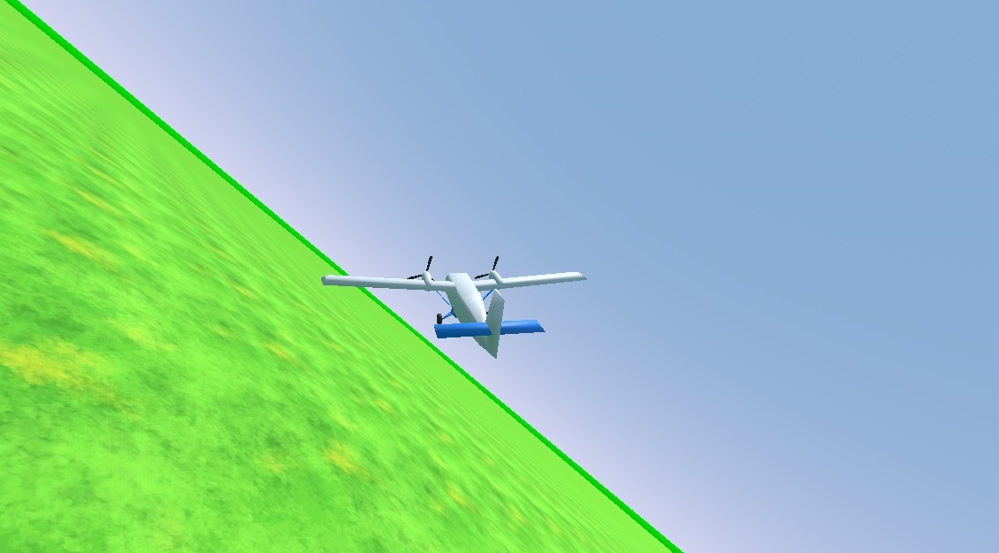

# Simple (arcade style) airplane controller for Godot (C#)

Free to use in your own projects, licensed under MIT.

Note: This project uses some CC0-licensed assets. No attribution is required, but if you wish to do so anyway, these are the asset creators:
- mfonasd: "The simplest blender game flight simulator": https://opengameart.org/content/the-simplest-blender-game-flight-simulator
- Fupi: "Grass": https://opengameart.org/content/grass-8
